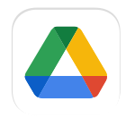
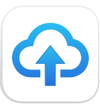

<p align="center">
  
</p>

<p align="center">
  <br> <a href="./README.md">中文</a> | English
</p>

<p align="center">
  <em><strong>Mnemo</strong> — remember every cloud.</em>
</p>

<p align="center">
  Free · open-source · multi-cloud manager + fast transfer + online preview/playback
</p>

<p align="center">
  
  
  
  
  
  
  
</p>

<p align="center">
  
  
  
  
  
</p>

---

## Name

**Mnemo** is from **Mnemosyne (Μνημοσύνη)** — Greek goddess of memory. One place to remember, browse, transfer, and open files across clouds and object storage.

---

## Features

### Active providers

Declared in `src/utils/driveProvider.ts`; login UI in `src/user/UserLogin.vue`. Unsupported actions are hidden or reported clearly.

Default login: **PikPak**.

| Drive | Auth | Overview |
|---|---|---|
| **PikPak** | Account | List, transfer, share, trash views, **cloud offline** |
| **OneDrive** | In-app OAuth (PKCE) | List, transfer, search, create share, basic ops |
| **Dropbox** | In-app OAuth (PKCE) | List, transfer, search, create share, revisions / thumbs |
| **Google Drive** | In-app OAuth (PKCE) | List, transfer, search, create share, trash-related (depth growing) |
| **GoFile** | API token | List, transfer, direct-link share, permanent delete (no recycle bin) |
| **WebDAV** | URL + credentials | Mounted storage, browse, direct upload |
| **S3** | Endpoint + keys | S3-compatible mount, browse, direct upload |

> Version **0.1.1-preview.x**. Trust in-app menus.  
> OAuth clients for OneDrive / Dropbox / Google Drive via `npm run secrets:generate`.  
> Aliyun Drive, Quark, 139, 189, Guangya, etc. are **not** product login targets anymore.

### File management

Folder tree + list, sort, batch ops, search (where enabled), properties, large directories, quick preview.

### Transfer

- Aria2 multi-connection HTTP download from direct links  
- **Lazy engine start** (not always-on at launch)  
- Upload (queued or direct for WebDAV/S3)  
- Task center; light **upload worker** (`worker.html`)  
- Remote Aria, limits, resume, notifications, prevent sleep (as configured)

### Cloud offline

PikPak: submit magnet/URL to provider offline download (files land on the cloud). Separate from local Aria downloads.

### Preview & playback

Artplayer + MPV, subtitles/audio tracks, playlist; image/PDF/Office/code/audio as file preview (not a media library product).

### Share

Create share where capability allows; import / my shares / history depend on the provider.

### Settings

UI, accounts, player, transfer, proxy, logs; confirm-before-install auto-update.

---

## Platforms

| OS | Arch | Artifacts |
|---|---|---|
| **Windows** | x64 | NSIS `.exe` |
| **macOS** | x64, arm64 | `.dmg` / `.zip` |
| **Linux** | x64, arm64 | `.AppImage` / `.deb` / `.pacman` |

Build: `npm run build:windows` / `build:mac` / `build:linux` / `build:all`.  
CI Windows preview: push `v*` tags or dispatch `.github/workflows/release.yml`.

---

## Main tabs

| Tab | Role |
|---|---|
| **Cloud** | Accounts, tree, files |
| **Transfer** | Upload / download jobs |
| **Share** | Shares & import (capability-gated) |
| **Settings** | Preferences |

---

## Develop

```bash
npm install
npm run dev
npm run build
npm run build:electron
npm run test
npm run typecheck
```

- Node **≥ 22.12**, **npm** + `package-lock.json`  
- Secrets: `.env.example` → `.env.local` → `npm run secrets:generate`

Stack: **Electron 40 · Vue 3 · Vite · Pinia · TypeScript · npm**.

- [AGENTS.md](./AGENTS.md) · [DESIGN.md](./DESIGN.md) · [docs/PROJECT_REVIEW.md](./docs/PROJECT_REVIEW.md) · [CONTRIBUTION.md](./CONTRIBUTION.md)

---

## Disclaimer

Personal use on your own data. Follow provider ToS and law. GPL-3.0 — [LICENSE](./LICENSE).

## Acknowledgments

- [rclone](https://rclone.org/) — multi-cloud storage practice and ideas.  
- [XiaoBaiYang / aliyunpan](https://github.com/gaozhangmin/aliyunpan) — open-source Aliyun Drive desktop client; file management and transfer ideas from the community.

## Develop & feedback

[CONTRIBUTION.md](./CONTRIBUTION.md) · [AGENTS.md](./AGENTS.md) · [Issues](https://github.com/lllll081926i/Mnemo/issues)
