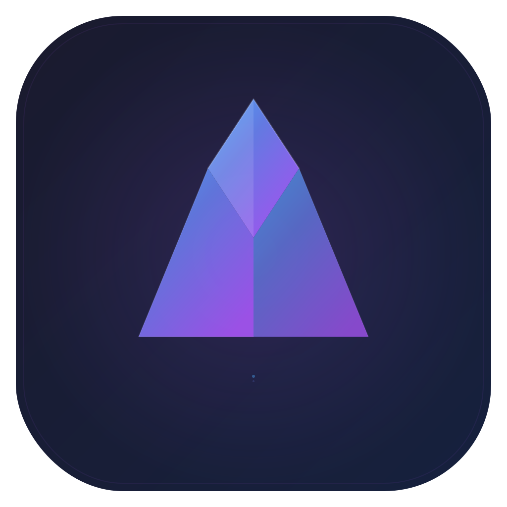
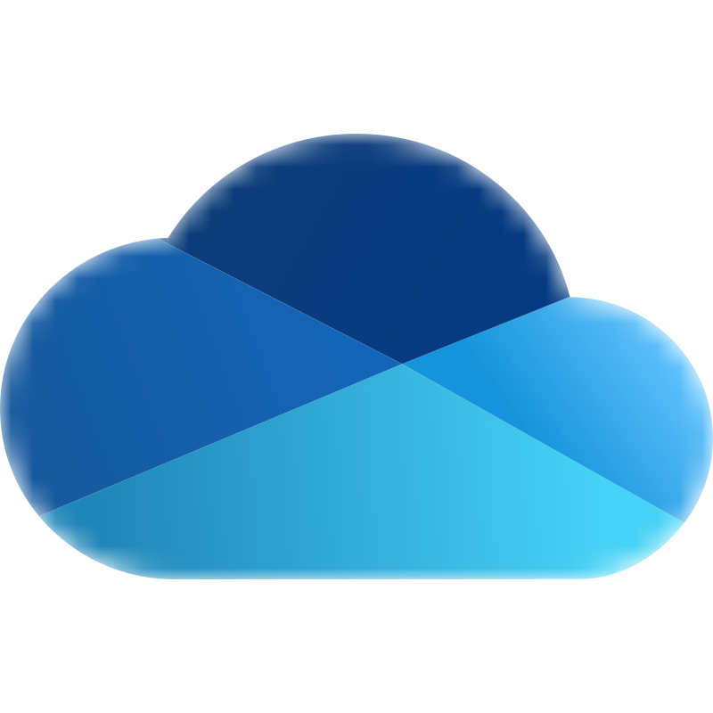
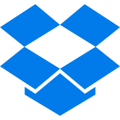

<p align="center">
  
</p>

<p align="center">
  <br> 中文 | <a href="./README.en.md">English</a>
</p>

<p align="center">
  <em><strong>Mnemo</strong> — 记住你的每一个网盘。</em>
</p>

<p align="center">
  免费 · 开源 · 多网盘统一管理 + 高速传输 + 在线预览播放
</p>

<p align="center">
  
  
  
  
  
  
  
  
  
  
  
  
</p>

<p align="center">
  
  
  
  
  
  
  
</p>

[](#名字) [](#功能) [](#界面) [](#安装与开发) [](#架构) [](#免责声明)

---

## 名字

**Mnemo** 取自希腊神话中的 **Mnemosyne（Μνημοσύνη）**——记忆女神，缪斯之母。

她守护记忆，也守护一切被讲述、被保存的事物。Mnemo 想做的也是这件事：把散落在各家网盘里的文件，收进同一处记忆，随时可找、可传、可看。

---

# 功能

## 🌟 支持的网盘

| 网盘 | 说明 |
|---|---|
| **阿里云盘** | 列表 / 上传下载 / 分享 / 预览播放等完整能力 |
| **百度网盘** | 浏览、传输、文件操作 |
| **123 网盘** | 浏览、上传、分享、云离线、视频等 |
| **115 网盘** | 浏览、传输、分享、云离线、字幕与带认证播放 |
| **PikPak** | 登录、列表、分享、云离线 |
| **夸克网盘** | 登录、浏览、上传下载、重命名、移动、分享、搜索 |
| **中国移动云盘（139）** | 登录、浏览、上传下载、重命名、移动 |
| **天翼云盘（189）** | 登录、浏览、上传下载、重命名、移动 |
| **OneDrive** | OAuth、列表、搜索、分享、上传、版本（视账号） |
| **Dropbox** | OAuth、列表、搜索、分享、上传、缩略图等 |
| **Box** | OAuth、列表、搜索、分享、上传、版本等 |
| **光鸭** | 列表、上传、分享、秒传、云离线、搜索等 |

> 具体菜单以账号类型与服务商 API 为准；不支持的能力会隐藏或明确提示，不会误调其它网盘接口。

1. **多平台网盘接入**：上表全部内置，统一账号体系与文件模型  
2. **多账号管理**：支持同时登录和管理多个网盘账号，快速切换  
3. **按盘裁剪能力**：列表、搜索、上传下载、重命名、移动、复制、删除、回收站、分享等按服务商真实能力展示，不暴露无效菜单  

## 📁 文件管理

4. **文件夹树视图**：左侧目录树 + 右侧文件列表，方便快速定位  
5. **智能排序**：支持按文件名 / 体积 / 时间排序，文件夹与文件混合排序  
6. **文件夹体积**：显示目录占用，便于清理与整理  
7. **批量操作**：批量重命名（含多层嵌套）、批量移动、复制、删除  
8. **新建与属性**：新建文件/文件夹，查看文件属性（部分盘支持版本信息）  
9. **搜索**：各盘关键词搜索（能力因服务商而异）  
10. **海量文件处理**：可管理数万级目录与文件，支持一次性列出目录内全部文件  
11. **快速预览入口**：视频雪碧图预览、图片预览、文档预览等  

## ⚡ 高速传输

12. **Aria2c 多线程下载**：集成 Aria2 引擎，网盘直链多连接分片下载到本地  
13. **上传**：支持文件 / 文件夹上传到网盘，分片与断点视服务商实现  
14. **任务中心**：下载中 / 已下载 / 上传中 / 已上传 分区管理  
15. **批量暂停 / 恢复 / 删除**：任务状态低延迟反馈  
16. **远程 Aria**：可将文件下载到远程 VPS / NAS 上的 Aria2  
17. **限速与高级参数**：上传/下载限速、连接数、分片等（设置页可调）  
18. **断点续传与会话恢复**：引擎托管、任务恢复（视配置）  
19. **完成通知**：下载完成系统通知（平台支持时）  
20. **防休眠**：传输进行中可阻止系统进入睡眠（引擎侧能力）  

## 🧲 网盘云离线

21. **云添加磁力 / 链接**：在支持的网盘上，把磁力或下载链接提交到**网盘服务器**离线下载，文件落在网盘内（如 115、123、PikPak、光鸭等，以各盘实际能力为准）  
22. **与本机下载分离**：云离线走服务商 API；本机多线程下载走 Aria HTTP 直链，互不混淆  

## 🎥 在线预览与播放

23. **在线高清播放**：网盘内视频原画 / 直链在线播放  
24. **内置播放器**：Artplayer 内核，支持常见封装与流式协议（如 HLS 等，视源而定）  
25. **MPV 在线预览**：支持使用 MPV 打开网盘视频（外置 / 嵌入链路，视平台打包资源）  
26. **多音轨 / 外挂字幕**：播放器内切换音轨、加载字幕轨道  
27. **清晰度与流切换**：多清晰度 / 多视频流时可选（视网盘转码或媒体源）  
28. **播放速度**：自定义倍速  
29. **播放列表**：同目录连续播放、进度记忆  
30. **认证 Header 链路**：对需要 Cookie / Authorization 的源（如部分 115、代理补齐场景）通过本地代理或播放器参数传递  
31. **图片预览**：图库式浏览  
32. **文档预览**：PDF、Office（Word/表格等）、文本 / 代码、EPUB 等打开即看（作为文件预览，非独立图书产品）  

## 🔗 分享

33. **创建分享链接**：将选中文件生成分享（有效期、提取码等视盘能力）  
34. **导入分享**：解析他人分享链接并转存到自己的网盘  
35. **我的分享**：查看与管理已创建的分享  
36. **历史导入**：记录导入过的分享（部分盘）  

## ⚙️ 设置与体验

37. **应用设置**：主题明暗、默认启动页签、关闭行为等  
38. **账户设置**：网盘账号登录 / 退出 / 多账号  
39. **播放器设置**：默认播放器、MPV 路径、相关播放选项  
40. **下载 / 上传设置**：目录、限速、连接数、远程 Aria 等  
41. **网络代理**：HTTP/SOCKS 等代理  
42. **安全与日志**：安全相关选项、运行日志查看  

## 🖥️ 支持的平台

| 系统 | 架构 | 安装包形态（electron-builder） |
|---|---|---|
| **Windows** | x64 | NSIS 安装包（`.exe`） |
| **macOS** | Intel x64、Apple Silicon arm64 | `.dmg` / `.zip`（可签名与公证） |
| **Linux** | x64、arm64 | `.AppImage` / `.deb` / `.pacman` |

- 桌面客户端基于 **Electron**，覆盖日常 PC / 笔记本与常见 Linux 发行版使用场景。  
- 各平台随包附带对应架构的 **Aria2** 等引擎资源；MPV 等播放组件按平台资源目录提供。  
- 构建命令：`npm run build:windows` / `build:mac` / `build:linux` / `build:all`。

## 🗂️ 主界面结构

| Tab | 内容 |
|---|---|
| **网盘** | 多账号、目录树、文件列表与批量操作 |
| **传输** | 上传 / 下载任务管理 |
| **分享** | 我的分享、导入链接、历史导入 |
| **设置** | 外观、账号、播放、传输、代理、日志 |

---

# 界面

## 网盘文件管理


*多网盘账号、文件夹树与文件列表统一管理。*

---

# 名字与理念（再述）

Mnemo ← **Mnemosyne**：记忆不是堆积，而是「需要时还能找回」。  
软件侧对应：统一登录、统一目录、统一传输与预览，减少在多个网页网盘之间来回切换的遗忘与摩擦。

---

# 安装与开发

## 环境

- **Node.js ≥ 22.12**
- **npm**（本仓库使用 npm；请使用 `package-lock.json`）

## 命令

```bash
npm install
npm run dev                 # Electron 热重载开发
npm run build               # 版本号 → 类型检查 → Vite 打包
npm run build:electron      # 完整安装包
npm run test                # Vitest 子集（Aria 等相关）
```

平台打包：

```bash
npm run build:windows
npm run build:mac
npm run build:linux
npm run build:all
```

密钥不进 Git：配置 `.env.local` 后执行：

```bash
npm run secrets:generate
```

生成 `src/secrets.generated.ts`（已 gitignore）。

---

# 架构

```
electron/main/     主进程：窗口、IPC、Aria2、MPV、协议、自动更新
electron/preload/  预加载桥
src/               Vue 3 渲染进程
  aliapi/          阿里云盘与统一文件模型 / 路由枢纽
  cloud*/…         各网盘 provider
  pan/             文件管理 UI
  down/            传输任务
  layout/          主壳与预览页（视频 / 图片 / PDF…）
  user/            网盘登录与账号
  setting/         设置页
shared/            主进程与渲染共享
static/engine/     各平台 aria2 / mpv 等资源
```

技术栈：**Electron 40 · Vue 3 · Vite · Pinia · TypeScript · npm**

新增网盘请遵循 [AGENTS.md](./AGENTS.md) 中的接入清单，不要只做文件列表。

---

# 与历史版本

本项目由早期多网盘客户端演进而来，产品名现为 **Mnemo**。  
当前版本收敛为「多网盘文件管理神器」：保留传输、预览播放与分享；媒体库刮削、媒体服务器客户端、音乐库、图书 AI、订阅 Pro、Agent CLI 等已移出主产品线。

---

# 免责声明

- 仅供学习与管理**自有**网盘数据使用。  
- 请遵守各网盘服务条款与当地法律法规。  
- 第三方 API 变更、限流、封号等风险由使用者自行承担。  
- 开源协议：[LICENSE](./LICENSE)（GPL-3.0）。

---

# 贡献

见 [CONTRIBUTION.md](./CONTRIBUTION.md)、[AGENTS.md](./AGENTS.md)。欢迎 Issue / PR。
